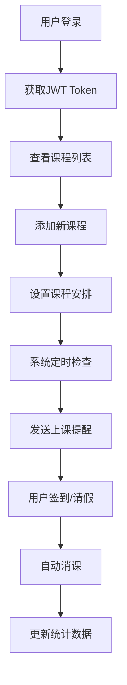

# 课程管理APP

##  核心价值
一个用AI辅助开发的个人效率工具，旨在解决 **“预付费课程（如培训、健身）消费进度不透明、用户依赖机构反馈、自主管理困难”** 的痛点。通过轻量化的Go技术栈与AI协作开发，实现用户对自有课程资产的清晰掌控。

## 解决的问题场景 
- 家长不知道孩子培训班剩余课时数，需反复联系机构  
- 健身会员记不清私教课使用进度，易产生消费纠纷  
- 多课程并行时，人工记录课时与上课提醒容易遗漏  


## 功能特性

- 📚 课程管理：添加培训班、健身卡、美容卡等服务
- ⏰ 智能提醒：上课前一天自动推送提醒
- 📊 消课统计：自动计算剩余课程次数
- 📱 移动端适配：响应式设计，支持手机使用
- 📸 合同管理：支持上传和管理课程合同
- ✏️ 灵活编辑：可编辑课程名称、课时数等信息


## 技术架构

### 后端技术栈
- **语言**: Go 1.21+
- **框架**: Gin
- **数据库**: SQLite (轻量级，易部署)
- **ORM**: GORM
- **推送服务**: Web Push API (支持PWA)

### 前端技术栈
- **框架**: React + TypeScript
- **UI库**: Ant Design Mobile
- **状态管理**: React Context + useReducer
- **构建工具**: Vite
- **PWA**: 支持安装到手机桌面

## 项目架构概览

本项目采用前后端分离架构，为移动端优化的课程管理应用。

### 整体架构图

```
┌─────────────────┐    HTTP/REST API    ┌─────────────────┐
│                 │ ◄─────────────────► │                 │
│   前端 (React)   │                     │  后端 (Go Gin)  │
│   - 用户界面     │                     │   - 业务逻辑    │
│   - 状态管理     │                     │   - 数据处理    │
│   - PWA支持     │                     │   - 推送服务    │
└─────────────────┘                     └─────────────────┘
                                                │
                                                ▼
                                       ┌─────────────────┐
                                       │                 │
                                       │  数据库 (SQLite) │
                                       │   - 用户数据     │
                                       │   - 课程信息     │
                                       │   - 出勤记录     │
                                       └─────────────────┘
```

### 技术架构

#### 后端技术栈 (Go)
- **框架**: Gin - 高性能HTTP Web框架，提供路由、中间件支持
- **数据库**: SQLite - 轻量级关系型数据库，无需额外安装
- **ORM**: GORM - Go语言对象关系映射库，简化数据库操作
- **认证**: JWT (JSON Web Tokens) - 无状态认证机制
- **任务调度**: 内置定时器 - 处理课程提醒等后台任务

#### 前端技术栈 (React + TypeScript)
- **框架**: React 18 + TypeScript - 组件化UI开发
- **UI库**: Ant Design Mobile - 专为移动端设计的React组件库
- **状态管理**: React Context + useReducer - 轻量级状态管理方案
- **构建工具**: Vite - 快速的前端构建工具
- **PWA**: Service Worker + Web App Manifest - 支持离线使用和手机安装

## 项目结构与模块说明

```
project-memory/
├── backend-go/              # 🚀 Go后端服务
│   ├── main.go             # 📥 应用入口 - 初始化路由、数据库连接、启动服务器
│   ├── config/             # ⚙️ 配置管理
│   │   └── database.go     # 数据库配置和连接初始化
│   ├── database/           # 🗄️ 数据库层
│   │   ├── connection.go   # 数据库连接管理
│   │   └── migrations.go   # 数据库迁移和表结构初始化
│   ├── models/             # 📋 数据模型 - 定义业务实体结构
│   │   ├── user.go         # 用户模型 (认证、登录)
│   │   ├── course.go       # 课程模型 (课程信息、课时统计)
│   │   ├── schedule.go     # 课程安排模型 (上课时间、重复规则)
│   │   ├── attendance.go   # 出勤记录模型 (签到、请假)
│   │   └── consumption.go  # 消课记录模型 (课时消耗)
│   ├── handlers/           # 🎯 HTTP处理器 - 处理API请求
│   │   ├── auth.go         # 认证相关 (登录、注册、JWT验证)
│   │   ├── course.go       # 课程CRUD操作
│   │   ├── schedule.go     # 课程安排管理
│   │   ├── attendance.go   # 出勤管理 (签到、请假处理)
│   │   ├── upload.go       # 文件上传 (合同图片)
│   │   └── stats.go        # 统计数据接口
│   ├── middleware/         # 🔧 中间件
│   │   ├── auth.go         # JWT认证中间件
│   │   └── cors.go         # 跨域处理中间件
│   ├── services/           # 💼 业务逻辑服务
│   │   ├── auth.go         # 认证服务 (密码加密、token生成)
│   │   ├── course.go       # 课程业务逻辑 (课时计算、消课)
│   │   ├── notification.go # 推送服务 (课程提醒)
│   │   └── scheduler.go    # 定时任务服务 (每小时检查提醒)
│   ├── utils/              # 🛠️ 工具函数
│   │   ├── response.go     # 统一API响应格式
│   │   └── validator.go    # 数据验证工具
│   ├── scripts/            # 📝 脚本文件
│   │   ├── init.go         # 数据库初始化脚本
│   │   └── seed.go         # 测试数据生成脚本
│   └── uploads/            # 📁 文件上传目录 (合同图片)
│
├── frontend/               # 🎨 React前端应用
│   ├── src/
│   │   ├── components/     # 🧩 可复用组件
│   │   │   ├── Layout/     # 布局组件 (导航栏、底部菜单)
│   │   │   ├── CourseCard/ # 课程卡片组件
│   │   │   ├── AttendanceButton/ # 出勤按钮组件
│   │   │   └── Notification/ # 通知组件
│   │   ├── pages/          # 📱 页面组件 (路由对应的页面)
│   │   │   ├── Login.tsx   # 登录页面
│   │   │   ├── Courses.tsx # 课程列表页面
│   │   │   ├── CourseDetail.tsx # 课程详情页面
│   │   │   ├── Attendance.tsx # 出勤管理页面
│   │   │   └── Profile.tsx # 个人中心页面
│   │   ├── services/       # 🌐 API服务层
│   │   │   ├── api.ts      # API基础配置和拦截器
│   │   │   ├── auth.ts     # 认证相关API
│   │   │   ├── course.ts   # 课程相关API
│   │   │   └── upload.ts   # 文件上传API
│   │   ├── types/          # 📝 TypeScript类型定义
│   │   │   ├── user.ts     # 用户相关类型
│   │   │   ├── course.ts   # 课程相关类型
│   │   │   └── api.ts      # API响应类型
│   │   ├── hooks/          # 🎣 自定义React Hooks
│   │   │   ├── useAuth.ts  # 认证状态管理
│   │   │   ├── useCourses.ts # 课程数据管理
│   │   │   └── useNotifications.ts # 通知管理
│   │   ├── utils/          # 🛠️ 工具函数
│   │   │   ├── storage.ts  # 本地存储工具
│   │   │   ├── date.ts     # 日期处理工具
│   │   │   └── notification.ts # 推送通知工具
│   │   ├── styles/         # 🎨 样式文件
│   │   │   ├── global.css  # 全局样式
│   │   │   └── variables.css # CSS变量定义
│   │   ├── App.tsx         # 🚀 应用根组件
│   │   └── main.tsx        # 📥 应用入口
│   ├── public/             # 🌍 静态资源
│   │   ├── manifest.json   # PWA应用清单
│   │   └── sw.js          # Service Worker (离线支持)
│   └── package.json
│
├── README.md              # 📖 项目说明文档 (本文件)
├── INSTALL.md            # 📦 详细安装指南
└── INSTALL-GO.md         # 🔧 Go版本特定安装指南
```

### 核心模块功能说明

#### 🎯 认证模块 (Auth)
- **位置**: `backend-go/handlers/auth.go`, `frontend/src/services/auth.ts`
- **功能**: 用户注册、登录、JWT令牌管理
- **流程**: 用户登录 → 生成JWT → 前端存储token → 后续请求携带token

#### 📚 课程管理模块 (Course)
- **位置**: `backend-go/handlers/course.go`, `frontend/src/pages/Courses.tsx`
- **功能**: 课程的增删改查、课时统计、合同上传
- **核心逻辑**: 课时计算 (正式课时 + 赠送课时 - 已消耗课时)

#### ⏰ 提醒系统模块 (Notification)
- **位置**: `backend-go/services/scheduler.go`, `frontend/src/utils/notification.ts`
- **功能**: 定时检查明日课程、推送通知、PWA支持
- **工作原理**: 后端每小时检查 → 前端接收提醒 → 显示通知

#### 📊 出勤管理模块 (Attendance)
- **位置**: `backend-go/handlers/attendance.go`, `frontend/src/pages/Attendance.tsx`
- **功能**: 签到/请假、自动消课、出勤统计
- **消课逻辑**: 优先扣除正式课时，用完后再扣赠送课时

## 数据流程图



## 数据库设计

### 用户表 (users)
- id: 主键
- username: 用户名
- password: 密码(加密)
- created_at: 创建时间

### 课程表 (courses)
- id: 主键
- user_id: 用户ID
- name: 课程名称
- total_amount: 总金额
- regular_sessions: 正式课程次数
- bonus_sessions: 赠送课程次数
- contract_path: 合同文件路径
- created_at: 创建时间
- updated_at: 更新时间

### 课程安排表 (course_schedules)
- id: 主键
- course_id: 课程ID
- weekday: 星期几(1-7)
- start_time: 开始时间
- end_time: 结束时间
- is_active: 是否启用

### 出勤记录表 (attendance_records)
- id: 主键
- course_id: 课程ID
- schedule_date: 上课日期
- status: 出勤状态(attend/absent/pending)
- created_at: 记录时间

### 消课记录表 (session_consumptions)
- id: 主键
- course_id: 课程ID
- sessions_consumed: 消耗课时数
- session_type: 课时类型(regular/bonus)
- attendance_id: 出勤记录ID
- created_at: 消课时间

## 快速开始

### 🚀 一键启动（推荐）

1. **查看详细指南**：`deployment-test/guides/` 文件夹
2. **选择数据库**：MySQL 或 SQLite  
3. **使用脚本启动**：
   ```bash
   # MySQL版本
   deployment-test/backend/start-mysql.bat
   
   # SQLite版本
   deployment-test/backend/start-sqlite.bat
   
   # 或者使用交互式启动
   deployment-test/tools/quick-start.bat
   ```

### 📖 手动启动

#### 1. 环境要求
- Go 1.21+ (后端)
- Node.js 16+ (前端)
- MySQL 或 SQLite (数据库)

#### 2. 安装依赖
```bash
# 安装Go后端依赖
cd backend
go mod tidy

# 安装前端依赖
cd ../frontend
npm install
```

#### 3. 启动服务
```bash
# 启动Go后端服务 (端口: 3001)
cd backend
go run main.go

# 启动前端服务 (端口: 3000) 
cd ../frontend
npm run dev
```

#### 4. 访问应用
- 前端应用: http://localhost:3000
- 后端API: http://localhost:3001

### 🧪 测试部署
详细测试指南请查看：`deployment-test/guides/` 文件夹

## API文档

### 认证接口
- `POST /api/auth/register` - 用户注册
- `POST /api/auth/login` - 用户登录

### 课程管理接口
- `GET /api/courses` - 获取课程列表
- `POST /api/courses` - 创建新课程
- `GET /api/courses/:id` - 获取课程详情
- `PUT /api/courses/:id` - 更新课程信息
- `DELETE /api/courses/:id` - 删除课程

### 课程安排接口
- `GET /api/courses/:id/schedules` - 获取课程安排
- `POST /api/courses/:id/schedules` - 添加课程安排
- `PUT /api/schedules/:id` - 更新课程安排
- `DELETE /api/schedules/:id` - 删除课程安排

### 出勤管理接口
- `GET /api/attendance` - 获取出勤记录
- `POST /api/attendance/:courseId/checkin` - 签到/请假
- `GET /api/attendance/today` - 获取今日课程

### 文件上传接口
- `POST /api/upload/contract` - 上传合同文件

## 核心功能说明

### 1. 提醒系统
- 使用浏览器的Notification API发送推送通知
- 每小时检查一次第二天的课程安排
- 支持PWA安装到手机桌面

### 2. 消课逻辑
- 签到时自动扣除1个课时
- 优先扣除正式课时，用完再扣赠送课时
- 实时更新剩余课时显示

### 3. 数据统计
- 剩余课时 = (正式课时 + 赠送课时) - 已消耗课时
- 出勤率统计
- 课程价值分析

## 开发指南

### 🚀 快速理解代码

#### 1. 后端API结构示例
```go
// backend-go/handlers/course.go
func GetCourses(c *gin.Context) {
    // 1. 获取用户ID (从JWT中间件)
    userID := c.GetInt("user_id")
    
    // 2. 查询数据库
    var courses []models.Course
    database.DB.Where("user_id = ?", userID).Find(&courses)
    
    // 3. 返回JSON响应
    c.JSON(http.StatusOK, gin.H{
        "success": true,
        "data":    courses,
    })
}
```

#### 2. 前端组件结构示例
```tsx
// frontend/src/pages/Courses.tsx
export const Courses: React.FC = () => {
    // 1. 状态管理
    const [courses, setCourses] = useState<Course[]>([]);
    
    // 2. API调用
    useEffect(() => {
        courseApi.getCourses().then(setCourses);
    }, []);
    
    // 3. UI渲染
    return (
        <div>
            {courses.map(course => (
                <CourseCard key={course.id} course={course} />
            ))}
        </div>
    );
};
```

#### 3. 数据模型关系
```go
// backend-go/models/course.go
type Course struct {
    ID              uint      `json:"id" gorm:"primaryKey"`
    UserID          uint      `json:"user_id"`           // 所属用户
    Name            string    `json:"name"`              // 课程名称
    TotalAmount     float64   `json:"total_amount"`      // 总金额
    RegularSessions int       `json:"regular_sessions"`   // 正式课时
    BonusSessions   int       `json:"bonus_sessions"`     // 赠送课时
    
    // 关联数据
    Schedules      []CourseSchedule      `json:"schedules,omitempty"`      // 课程安排
    Attendances    []AttendanceRecord    `json:"attendances,omitempty"`    // 出勤记录
    Consumptions   []SessionConsumption  `json:"consumptions,omitempty"`   // 消课记录
}
```

### 🛠️ 开发环境要求
- Go 1.21+ (后端开发)
- Node.js 16+ (前端开发)
- Git (版本控制)

### 📋 开发规范
- **代码风格**: Go使用gofmt格式化，前端使用ESLint + Prettier
- **API设计**: 遵循RESTful原则，统一返回格式
- **类型安全**: 前端使用TypeScript，后端使用结构体验证
- **提交规范**: 使用Conventional Commits格式

### 🔧 添加新功能流程
1. **后端**: `models/` → `handlers/` → `services/`
2. **前端**: `types/` → `services/` → `components/pages/`
3. **测试**: 先测试API，再测试UI交互

### 📦 部署建议
- **后端**: 可部署到Railway、Render、Heroku等支持Go的平台
- **前端**: 可部署到Vercel、Netlify等静态托管平台
- **数据库**: 开发用SQLite，生产建议PostgreSQL
- **文件存储**: 开发本地存储，生产建议使用云存储服务

## ❓ 常见问题

### Q: 如何添加新的API接口？
**A**: 
1. 在 `backend-go/models/` 定义数据结构
2. 在 `backend-go/handlers/` 编写处理函数
3. 在 `main.go` 中注册路由
4. 在 `frontend/src/services/` 添加API调用

### Q: 如何修改数据库结构？
**A**: 
1. 修改 `backend-go/models/` 中的模型
2. 运行 `go run scripts/migrate.go` 进行数据库迁移
3. 更新相关的API和前端代码

### Q: 推送通知不工作怎么办？
**A**: 
1. 确保网站已获得通知权限
2. 检查浏览器是否支持PWA
3. 确认Service Worker已正确注册
4. 浏览器地址栏应显示🔔图标

### Q: 如何部署到生产环境？
**A**: 
1. 后端：编译Go程序 `go build -o app`
2. 前端：构建静态文件 `npm run build`
3. 配置生产环境变量(数据库连接、JWT密钥等)
4. 使用Docker或直接部署到云平台

### Q: 性能优化建议？
**A**: 
- 后端：使用数据库索引、连接池、缓存
- 前端：使用React.memo、代码分割、懒加载
- 数据库：为常用查询字段添加索引

## 🔗 相关链接
- [Go官方文档](https://golang.org/doc/)
- [React官方文档](https://react.dev/)
- [Ant Design Mobile](https://mobile.ant.design/)
- [GORM文档](https://gorm.io/docs/)
- [Gin框架文档](https://gin-gonic.com/docs/)

## 许可证

MIT License